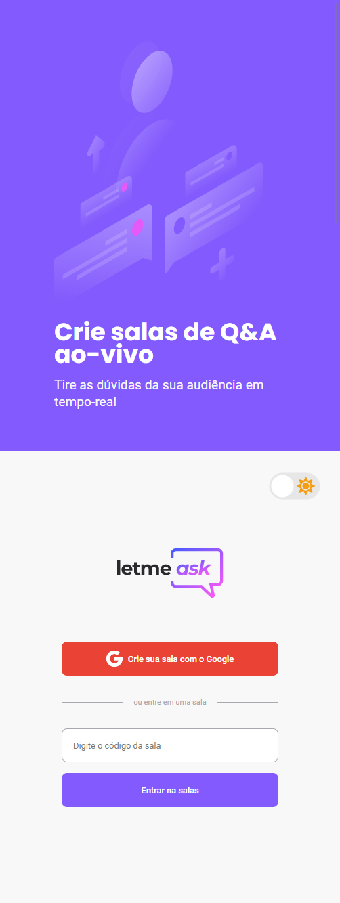
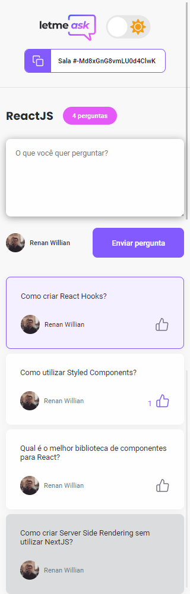
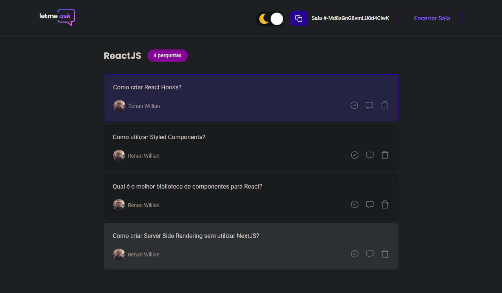
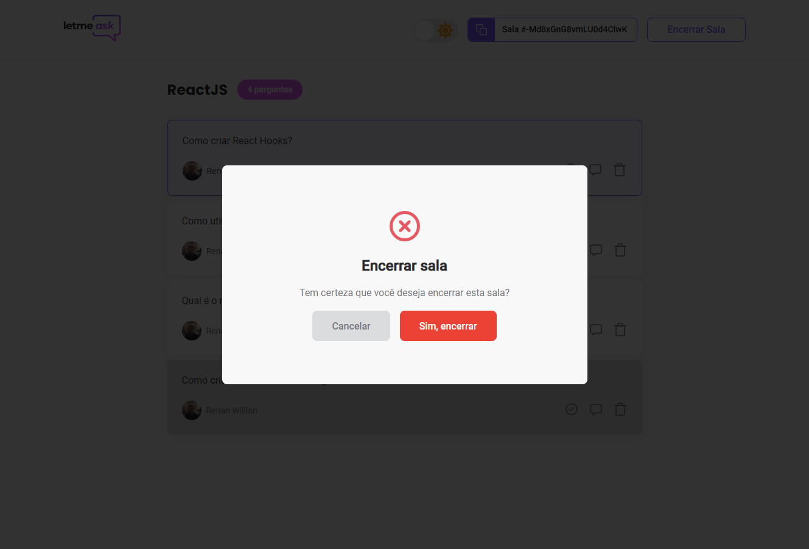

<p align="center">
  <a href="https://letmeask-6e711.web.app/" target="_blank">
    
  </a>
</p>

<h1 align="center">
  <a href="https://letmeask-6e711.web.app/" target="_blank">
    
  </a>
</h1>

<br>

## 🧪 Tecnologias

Esse projeto foi desenvolvido com as seguintes tecnologias:

- [React](https://reactjs.org)
- [Firebase](https://firebase.google.com/)
- [TypeScript](https://www.typescriptlang.org/)

## 🚀 Como executar

Clone o projeto e acesse a pasta do mesmo.

```bash
$ git clone https://github.com/renanwillian/nlw-letmeask.git
$ cd nlw-letmeask
```

Para iniciá-lo, siga os passos abaixo:
```bash
# Instalar as dependências
$ yarn

# Iniciar o projeto
$ yarn start
```
O app estará disponível no seu browser pelo endereço http://localhost:3000.

Lembrando que será necessário criar uma conta no [Firebase](https://firebase.google.com/) e um projeto para disponibilizar um Realtime Database.

## 💻 Projeto

  <a href="https://letmeask-6e711.web.app/" target="_blank">Letmeask</a> é perfeito para criadores de conteúdos poderem criar salas de Q&A com o seu público, de uma forma muito organizada e democrática. 

Este é um projeto desenvolvido durante a **[Next Level Week Together](https://nextlevelweek.com/)**, apresentada dos dias 20 a 27 de Junho de 2021.

## 📈 Melhorias

### Layout Responsivo

<h1 align="center">
  
  
</h1>

### Tema Escuro



### Modal



Entre outras pequenas melhorias como organização do código typescript, toast messages, ordenação das perguntas, utilização de variáveis SASS, validação de usuário autenticado, etc...
